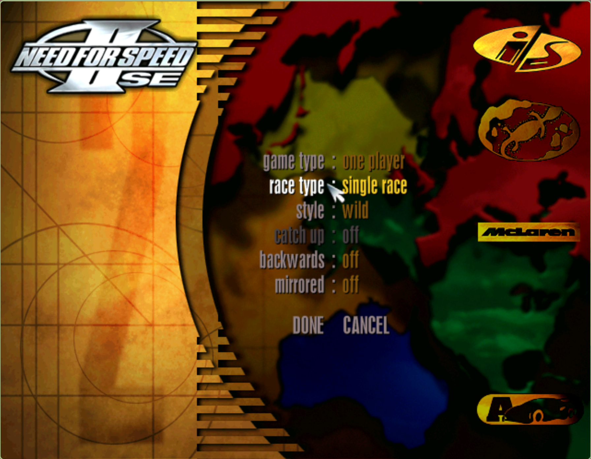
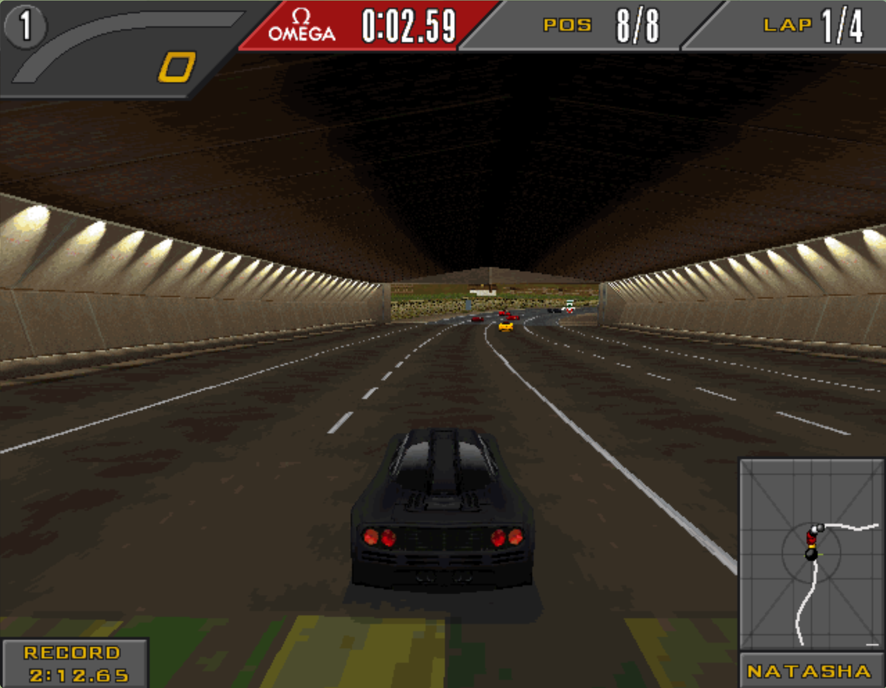
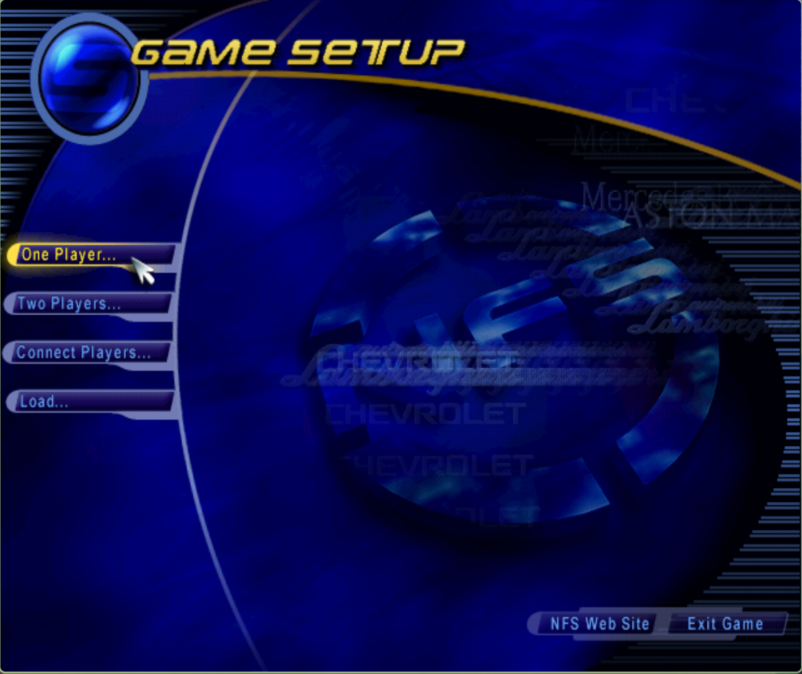
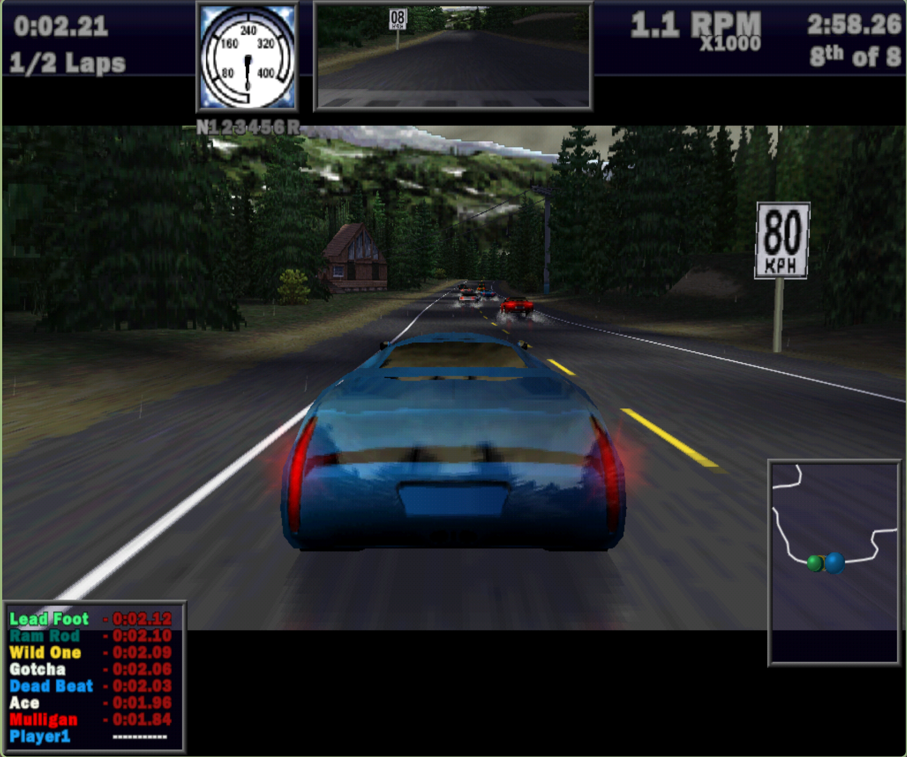

**DISCLAIMER**

Readme and CMakeLists mostly AI-generated.

# nfs-recompiled

A static recompilation of **Need for Speed II: Special Edition** and **Need for Speed III: Hot Pursuit** from their original Win32 x86 executables into portable C++ that runs natively on Linux (and potentially other platforms). This is a toy project and not meant to be serious. But it works.

<a href="screenshots/nfsiise-1.png"></a>

<a href="screenshots/nfsiise-2.png"></a>

<a href="screenshots/nfsiise-3.png"></a>

<a href="screenshots/nfsiiihp-1.png"></a>

<a href="screenshots/nfsiiihp-2.png"></a>

The project automatically disassembles the original PE binaries with a makeshift disassembler, translates the machine code into C++ operating on a virtual x86 CPU struct, and links it against hand-written crappy reimplementations of the Win32 API, DirectX, and 3Dfx Glide — all backed by SDL2 and OpenGL.

## How it works

1. **Python disassembler** (`disasm/`) — Uses Capstone to disassemble the original `.exe` and `.dll` files and emit C++ source files that reproduce the original program logic as function calls on a virtual CPU.
2. **Virtual x86 CPU** — A `x86::CPU` struct (`include/cpu.h`) with general-purpose registers, flags, a full x87 FPU (with optional 80-bit extended precision via NASM routines), and MMX support.
3. **Win32 API layer** — Minimal, native C++ reimplementations of 18 Win32 API modules (kernel32, user32, gdi32, DirectDraw, DirectInput, DirectSound, Glide 2x, etc.) provide the runtime environment the original code needs (but, really, nothing more).
4. **SDL2 + OpenGL backend** — Platform services (windowing, audio, input, file I/O, timers, threads) are implemented on top of SDL2. The Glide 2x renderer translates 3Dfx draw calls into OpenGL with a minimal GLSL shader.

The games work but the SDL backend is sketchy and minimal. I called it good enough when the whole game could run, even if many features are missing.

### Supported games

| Game | Executable | DLLs | Target |
|---|---|---|---|
| NFS II: SE | `nfs2se/nfs2sen.exe` | `eacsnd.dll` | `nfs2se` |
| NFS III: HP | `nfs3hp/nfs3.exe` | `eacsnd.dll`, `softtria.dll`, `voodoo2a.dll` | `nfs3hp` |

## Prerequisites

- CMake ≥ 3.15
- A C++17 compiler (GCC or Clang)
- Python 3 (with [Capstone](https://www.capstone-engine.org/) for disassembly)
- SDL2 development libraries
- OpenGL development libraries
- NASM (assembles the x87 FPU helper routines)

### Installing dependencies (Debian / Ubuntu)

```bash
sudo apt install build-essential cmake nasm python3 python3-pip \
               libsdl2-dev libgl-dev
pip3 install capstone
```

## Original game files

The disassembler only works on the provided executables/dlls. You must supply the original data files yourself, from the CD and an installed folder. 

## Building

```bash
cmake -B build -DCMAKE_BUILD_TYPE=Release
cmake --build build
```

The first build runs the Python disassembler to generate C++ from the PE binaries. Subsequent builds only regenerate if the disassembly scripts or original binaries change.

### CMake options

| Option | Default | Description |
|---|---|---|
| `WITH_PEDANTIC_FPU` | `OFF` | Use strict 80-bit extended-precision FPU emulation. |
| `WITH_MMX` | `ON` | Enable MMX instruction support |

Example:

```bash
cmake -B build -DWITH_PEDANTIC_FPU=ON -DWITH_MMX=ON
```

Pedantic FPU is not necessary except for NFS3 if MMX is turned off (defautl is on) AND using the software renderer (default to voodoo).
In this special case, the game uses the FPU to blit surfaces onto the screen.
The screen copy loads 80 bits of pixel data into the FPU then stores the 80 bits onto another surface. 
The default FPU implementation uses ```double``` which is not large enough. Because of this, pixel data is lost and the screen contains vertical lines of random data.

## Running

```bash
# NFS II: SE — game data in current directory, CD copied into the game data
./build/nfs2se

# NFS III: Hot Pursuit — game data in current directory, CD copied into the game data
./build/nfs3hp
```

### Command-line options

Both executables accept the following arguments:

| Argument | Description |
|---|---|
| `--data <path>` | Path to the local game install directory (default: `./`) |
| `--cd <path>` | Path to the CD-ROM content directory (default: `./`) |

The original game executable reads a file called ```install.win``` to know which files are on the CD and which files are on disk.
It is possible to copy the remaining data from the CD and change ```install.win``` so that it does not need the CD.

```bash
# Game installed to ~/nfs2se, CD image mounted at /mnt/cdrom
./build/nfs2se --data ~/nfs2se --cd /mnt/cdrom
```

## Project structure

```
disasm/                  Python disassembly framework
  codegen/               x86 instruction → C++ code generators
  ordlookup/             DLL ordinal-to-name lookup tables
disassemble_nfs2se.py    Disassembly driver for NFS II: SE
disassemble_nfs3hp.py    Disassembly driver for NFS III: HP
include/
  cpu.h                  Virtual x86 CPU struct (registers, flags)
  fpu.h                  x87 FPU emulation (80-bit extended precision)
  mmx.h                  MMX instruction support
  x86.h                  Base register types and utility macros
  lib/                   Platform abstraction headers
  winapi/                Win32 API reimplementation headers
    ddraw/               IDirectDraw interfaces
    dinput/              IDirectInput interfaces
    dsound/              IDirectSound interfaces
src/
  lib/                   Shared runtime library (nfs_core)
    sdl-backend/         SDL2 platform backend (file, audio, events, etc.)
    winapi/              Win32 API implementations
    x87.asm              NASM routines for 80-bit FPU operations
  nfs2se/                NFS II: SE entry point + generated disassembly
  nfs3hp/                NFS III: HP entry point + generated disassembly
nfs2se/                  Original executables that can be decompiled for NFS2: SE
nfs3hp/                  Original executables that can be decompiled for NFS3: HP
```